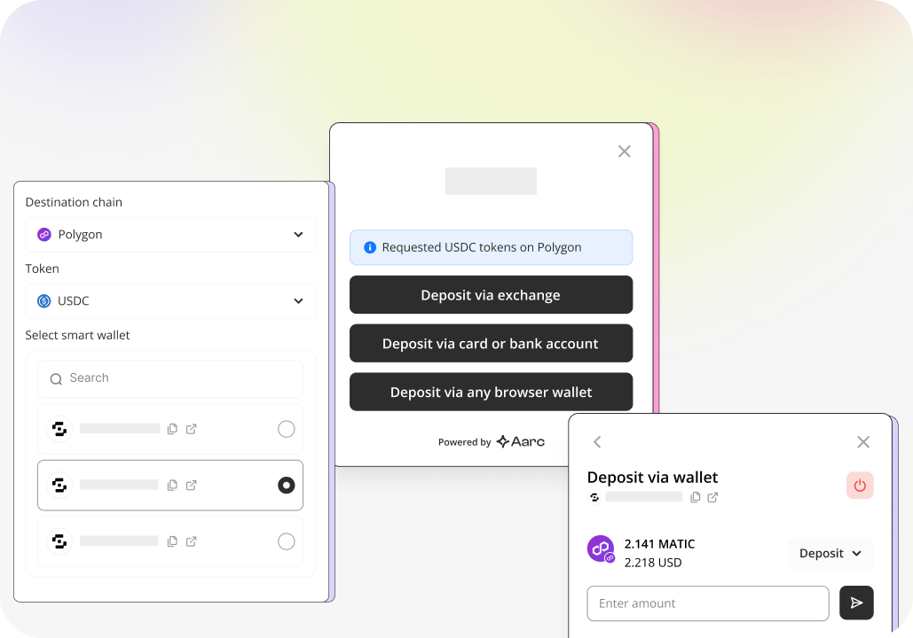

# Fund Kit

Aarc Fund Kit is a powerful cross-chain execution engine that enables instant and low-cost execution of any multichain transaction or strategy. It aims to change how crypto asset deposits and omni-chain transactions are made. Powered by our smart API, it is for developers, token creators, and AI Agents.

<figure><figcaption>
Effortless transfer of liquidity across all platforms - both  Web2 and Web3.
</figcaption></figure>

### **You can get started here** ⬇️

[quickstart](../developers/quickstart.md)

***

## Fund Kit Offerings

Aarc aims to streamline omnichain transactions and enhance liquidity movement. Our Fund Kit, which includes tools for bridging, swapping, exchanges, on-ramps, relayers, and an indexer, simplifies cross-chain execution and reduces the need for multiple integrations by dapp developers. **With our Fund Kit, you can accommodate all types of users, including Web2, Web2.5, and Web3.**

1. **Browser wallets and EOAs (Web3 Users)**: Users can onboard assets from web-based wallets like MetaMask or other EOAs.
2. **Centralized exchanges (Web2.5 users)**: Assets from exchanges like Coinbase, Binance, etc., can be seamlessly integrated.
3. **Fiat ramps (Web2 users)**: New Web3 users can convert their fiat currency into crypto for easy onboarding.

<table data-view="cards"><thead><tr><th>Feature</th><th>Detail</th></tr></thead><tbody><tr><td><strong>Smart API for Developers</strong></td><td>Aarc's API customizes call data for each user, simplifying integration and development while ensuring effective interaction with smart contracts on different blockchains.</td></tr><tr><td><h4><strong>Fast and Reliable Data</strong></h4></td><td>With Aarc, developers can access accurate routes and call data, while users can enjoy efficient transactions with high success rates across multiple blockchains.</td></tr><tr><td><strong>Security</strong></td><td>Our system does not require asset approvals for on-chain smart contracts, only for Uniswap's <code>permit2</code> contract, ensuring secure transactions without compromising functionality.</td></tr><tr><td><strong>Payments Management</strong></td><td>To simplify cross-chain payments, businesses can streamline transactions with single-click settlements and seamless payment links.</td></tr><tr><td><strong>Customisable React Widget</strong></td><td>The Aarc Fund Kit provides a user-friendly, customizable React widget that can be tailored to match your dapp's branding and maintain brand identity and user experience. This allows developers to go to market quickly.</td></tr></tbody></table>

***

## Fund Kit **Use Cases**

#### **Cross-Chain Swaps**

Experience seamless cross-chain swaps with the Aarc Fund Kit. It lets users swap tokens across different chains, even the non-EVM ones, without hassle. For example, swapping GMX tokens on Arbitrum for WETH tokens on the Polygon Mainnet. Our smart API takes care of finding the best execution path, whether it's on-chain or off-chain. Users can sit back and enjoy a smooth transaction experience without worrying about the routing and execution process.

#### **Cross-Chain Deposits**

Leverage your assets across multiple chains effortlessly with the Aarc Fund Kit. Imagine having USDT on Ethereum and wanting to open a trading position on a DEX on Optimism. With our kit, you can do this without managing multiple wallets or manually transferring assets between chains. The Aarc Fund Kit takes care of all the asset routing quietly, making the experience straightforward for users.

#### **Cross-Chain Orchestration**

The Aarc Fund Kit streamlines cross-chain contract interactions, making it easy for developers to bridge funds and execute operations across different blockchain networks. This feature is a game-changer, especially for DeFi projects and yield aggregators that work with multiple contracts across various ecosystems to maximize returns and enhance functionalities.

#### **Cross-Chain Checkouts**

Simplify your cross-chain asset purchases with the Aarc Fund Kit. It turns the process into a one-click operation. For instance, if you hold ETH on Ethereum and want to purchase an NFT on Zora, which operates on a different chain, our kit makes it effortless. Just initiate the purchase, and the Aarc Fund Kit will automatically route the ETH from Ethereum to Zora to complete the NFT purchase. This integration hides all the technical complexities from the user, ensuring a fast and efficient transaction process.

***
