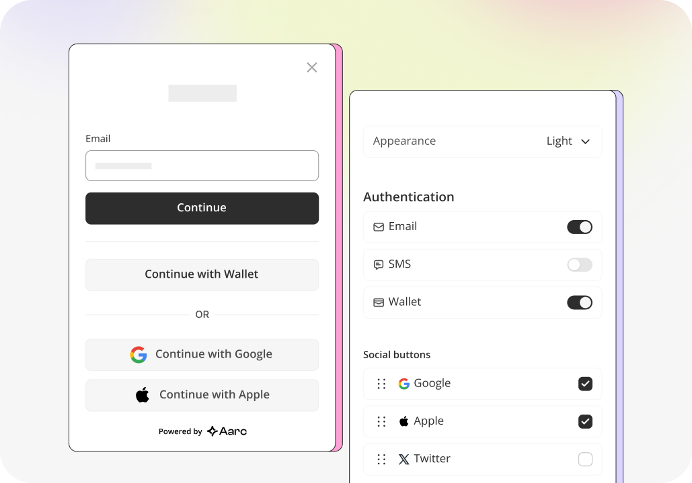

# Introduction & Use Cases

## Introduction

***

OpenAuth is a groundbreaking open-source project that seamlessly integrates social logins with wallets on decentralized applications (DApps). Built on Lit Protocol's robust infrastructure, OpenAuth delivers a secure, user-friendly experience that prevents fund and access fragmentation while fully embracing decentralization principles.

In a decentralized world, accessibility shouldn't compromise security or ownership. OpenAuth embodies this philosophy, offering a solution that combines the convenience of social logins with the security and control of decentralized wallets.

## Benefits of Open Source

***

As an open-source project, OpenAuth aligns with Web3's core ethos of decentralization, transparency, and community governance. This approach ensures its relevance in a rapidly evolving technological landscape.

Key benefits of OpenAuth's open-source nature include:

1. **Interoperability and Zero Lock-in**: Enables the creation of open standards and easy integration with other projects.
2. **Cost Reduction and Accessibility**: No licensing fees, reducing adoption costs for developers and projects of all sizes.
3. **Customization and Integration Flexibility**: Developers can create specialized versions for niche use cases.
4. **Enhanced Security and Trust Through Transparency**: Global scrutiny of the codebase fosters a robust security ecosystem.
5. **Community-Driven Innovation**: Leverages collective expertise for rapid feature development and problem-solving.
6. **Long-term Sustainability**: Ensures the project's longevity through community support and contributions.

## OpenAuth Features

***

| Features                                                                          | Explanation                                                                                                                                                                                                                         |
| --------------------------------------------------------------------------------- | ----------------------------------------------------------------------------------------------------------------------------------------------------------------------------------------------------------------------------------- |
| <h4><strong>Customisable Native Modal and In-dapp Wallet Manager</strong></h4>    | We provide a customizable widget modal and an in-dApp Wallet Manager, allowing developers to tailor authentication pop-ups and the wallet interface to their brand and dapp needs.                                                  |
| <h4><strong>Streamlined Single Sign-On (SSO)</strong></h4>                        | We offer a Single Sign-On (SSO) feature that maps email addresses as unique identifiers. This feature simplifies the login process and ensures the same address is generated and used, enhancing the reusability of user addresses. |
| <h4><strong>Interoperability without Vendor Lock-in</strong></h4>                 | We are backward compatible with the Lit Protocol, allowing existing Lit users to use the same account across different platforms and apps without needing a new address.                                                            |
| <h4><strong>Session Keys</strong></h4>                                            | We use the Lit Protocol’s MPC network as the default session key post-authentication. These temporary session keys confirm transactions without continuous user signatures, improving user experience.                              |
| <h4><strong>Unified Access with WalletConnect and other Aggregators</strong></h4> | We are natively integrated with WalletConnect, enabling access to Aarc user addresses on dApps without direct OpenAuth API/Widget incorporation. This unifies all authentication processes onto a single screen.                    |
| <h4><strong>In-built Key Rotation for Extra security</strong></h4>                | The OpenAuth kit enhances security by implementing key rotation for PKPs, ensuring the integrity and security of user data and transactions.                                                                                        |

## OpenAuth Use Cases

***

**Secure User Onboarding**

* **Unified Account Management:** OpenAuth simplifies wallet creation and management by using familiar Web2 authentication methods like Gmail, making blockchain interactions more accessible.
* **Enhanced Security with PKPs:** OpenAuth uses Lit Protocol's DKG to increase security, preventing single-node access to the full private key.
* **Key Rotation:** OpenAuth has a key rotation mechanism that regularly updates key shares, reducing potential vulnerabilities.

#### **Easy User Interoperability**

* **WalletConnect Integration:** OpenAuth extends user access within the Web3 ecosystem, allowing connections to various dApps.
* **Interoperable User Addresses:** OpenAuth provides a single public address across services, reducing fragmentation and simplifying asset management.

#### **Customizable User Experience**

* **Customizable Interfaces:** OpenAuth offers customizable modals and in-app wallet managers, allowing developers to tailor the aesthetics and functions of their dApps.
* **Tailored Security and Transaction Settings:** OpenAuth enables customization of signing and authentication processes with Lit Actions.

#### **Orchestrate User Identity**

* **Support for Multiple Providers:** OpenAuth supports various OAuth providers, ensuring a unified login experience.
* **Advanced Identity Orchestration:** OpenAuth aids in creating a unified identity, connecting user authentication methods to a single account address.

***

### **You can get started here** ⬇️

[using-openauth.md](using-openauth.md)
